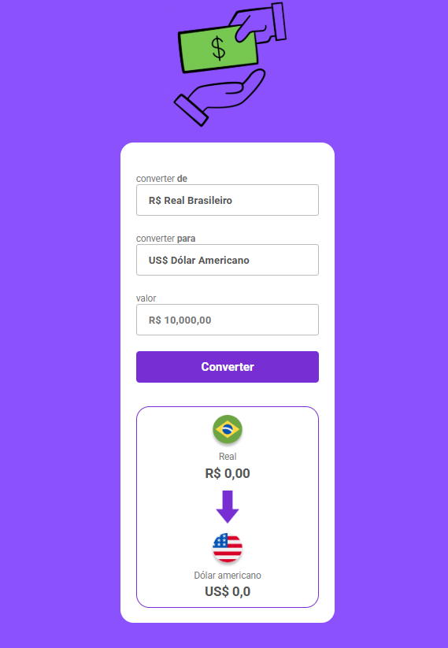

# 💱 Conversor de Moedas

Este é um projeto simples de **conversor de moedas** desenvolvido com **HTML**, **CSS** e **JavaScript**, ideal para praticar conceitos de manipulação de DOM, consumo de APIs e estilização de interfaces.

## 🚀 Funcionalidades

- Conversão de valores entre diferentes moedas.
- Interface amigável e responsiva.
- Atualização automática das taxas de câmbio com base em uma API externa.
- Validação de entrada do usuário.

## 🖥️ Tecnologias Utilizadas

- HTML5
- CSS3
- JavaScript
- API de Câmbio (ExchangeRate-API, por exemplo)

## 📸 Imagem do Projeto



> 💡 Dica: salve um print da tela do seu projeto na pasta `assets` e renomeie como `preview.png`, ou altere o caminho conforme necessário.

## 📂 Como Usar

1. Clone o repositório:
   ```bash
   git clone https://github.com/rafaelqueiroz11/Convertor-de-Moedas.git
   ```
2. Abra o arquivo `index.html` em seu navegador.

## 📈 Exemplo de Uso

Digite o valor, selecione a moeda de origem e a moeda de destino. O resultado será atualizado automaticamente com a taxa de câmbio atual.

## ✅ Melhorias Futuras

- Adicionar mais moedas.
- Implementar histórico de conversões.
- Suporte offline com cache de última taxa usada.
- Troca automática entre moedas (botão "inverter").

## 🧑‍💻 Autor

- **Rafael Neves Queiroz**
- [LinkedIn](https://www.linkedin.com/in/rafael-neves-queiroz)
- [GitHub](https://github.com/rafaelqueiroz11)
